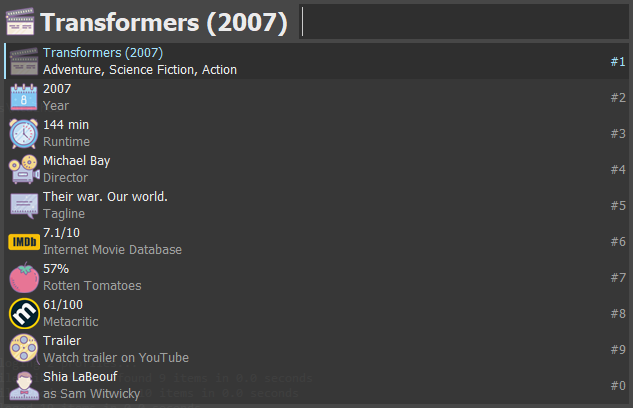

<p align="center">
  
</p>

# Keypirinha Plugin: MovieDB

This is MovieDB, a plugin for the
[Keypirinha](http://keypirinha.com) launcher.

Search through TMDB (themoviedb.org) for movies, TV shows and people.


## Download
https://github.com/Fuhrmann/keypirinha-moviedb/releases/latest

## Install

#### Managed
[@ueffel](https://github.com/ueffel) wrote [PackageControl](https://github.com/ueffel/Keypirinha-PackageControl), a package manager that eases the install of third-party packages.
It must be installed manually.

#### Manual
Once the `MovieDB.keypirinha-package` file is installed,
move it to the `InstalledPackage` folder located at:

* `Keypirinha\portable\Profile\InstalledPackages` in **Portable mode**
* **Or** `%APPDATA%\Keypirinha\InstalledPackages` in **Installed mode** (the
  final path would look like
  `C:\Users\%USERNAME%\AppData\Roaming\Keypirinha\InstalledPackages`)

## Usage

There are three catalog items provided by this package, they are:
- Search movies
- Search TV shows
- Search people

Each catalog item is responsible for searching for its respective media type (movies, tv shows and people).
Let's say you selected a movie (pressing TAB). Keypirinha will load the details from that media and present you in a form of suggestions:

#### Movie details:


#### TV show details:


#### Person details


There are some cases when you can navigate between movies/tv shows and people, e.g:

```
├── The Godfather (1972) -> your first selected item
├── 1972 -> select the year, to get all movies from 1972
│   ├── Search all movies from 1972
│   │   ├── ...
├── Al Pacino as Michael Corleone
│   ├── ...
├── James Caan as Santino Corleone
│   ├── ...
├── Marlon Brando as Don Vito Corleone -> select this actor, to get his info
│   ├── Born in 1924-04-03
│   ├── Apocalypse Now (1979)
│   ├── The Godfather (1972)
│   ├── On the Waterfront (1957) -> select this movie to get its info
│   │   ├── 1954
│   │   │   ├── Search all movies from 1972
│   │   │   │   ├── ...
│   │   ├── Marlon Brando as Terry Malloy
│   │   └── ...
```

- Select (press tab) the year from a movie info to search all movies from that year;
- Select (press tab) the director of a movie to open his info;
- Select (press tab) a movie that an actor/actress has participated in to see the info of the movie;
- Select (press tab) a actor/actress from the movie info to see his/her information;

Here it's a list of the default actions, how to trigger them and what they do:

| Suggestion item  | Tab         |   Enter    |
|:-----------:|-------------|------------|
| Year        | Filter all movies/tv shows from the year | Open TMDB website listing all movies/tv shows from the year |
| Trailer     | - | Open the trailer in the browser |
| Person | Open person info | Open TMDB website with person info
| Movie | Open movie info | Open TMDB website with movie info
| Rating | - | Open related website|
| Load more | Go to the next page of results | -
| Any other | - | Copy the text to clipboard

## Configuration

### Main configuration

```
# The key used to call TMDB API
# Get your own key at https://www.themoviedb.org/settings/api
# * Default already configured, you do not need to provide your own, unless you want it.
tmdb_api_key =

# The key used to call OMDB API
# Get your own key at http://www.omdbapi.com/apikey.aspx
# * Default already configured, you do not need to provide your own, unless you want it.
omdb_api_key =

# Number of seconds after cache (from API calls) will be expired.
# * Default: 86400 seconds (1 day)
cache_expire_after =

# Use an ISO 639-1 value to display translated data for the fields that support it.
# * Default: en-US
language =
```

*** If you are having problems with this plugin I recommend you to generate your own API keys. The TMDB API limits 40 requests every 10 seconds. OMDB API limits 1.000 requests every day.

### Customizing the default search presets

When you select a catalog item, a list of search presets will be loaded, either for movies or tv shows:
- Popular (for movies and tv)
- Top Rated (for movies and tv)

Each one of this presets can be enabled/disabled, customized and you can even add [your own](#creating-your-own-search-presets)!

To customize a default search preset, open the configuration file for MovieDB and add an entry to your configuration file as below:

```
# Here we're customizing the 'Popular' search preset in the Movies
[search_preset/PopularMovies]
label = Popular Movies
enabled = True # set False to completly disable this search

# Here we're disabling the 'Top Rated' search preset in TV Shows
[search_preset/TopRatedTVShows]
enabled = False
```

Here is the names of the search presets that already ships with this plugin:

- [search_preset/TopRatedMovies]
- [search_preset/PopularMovies]
- [search_preset/TopRatedTVShows]
- [search_preset/PopularTVShows]

You can always refer to the configuration file to check the names.

### Creating your own search presets

To create your own search presets open the configuration file for MovieDB and add an entry to your configuration file as the examples below:

#### Get the most popular movies from 2001

```
[search_preset/PopularMoviesFrom2001]
label = Popular/2001
description = Get a list of popular movies from 2001
media_type = movie
search_args =
    primary_release_year 2001
    sort_by popularity.desc
enabled = True
```

#### Get the best drama movies
```
[search_preset/BestDrama]
label = Best drama
description = Get a list of the best drama movies
media_type = movie
search_args =
    with_genres drama
    sort_by vote_average.desc
    vote_count.gte 10
enabled = True
```

#### Get the most popular comedy shows from 1996
```
[search_preset/PopularCommedyShows1996]
label = Popular comedy/1996
description = Get a list of the most popular comedy shows from 1996
media_type = tv
search_args =
    with_genres comedy
    sort_by popularity.desc
    first_air_date_year 1996
enabled = True
```

The complete list of available `search_args` can be found in the [TMDB documentation](https://developers.themoviedb.org/3/discover/movie-discover).

## Custom queries

If you're not a configuration expert to add your own presets there is another way to search! You can use the search box to perform some cool searches and get some cool results. The examples below can be used in both Movies and TV Shows catalog:

*** Note that it's not required for you to use 'and' between the queries. You can split the queries just by typing a whitespace between them: `genre:action year:2001`

#### Get all action movies from 2001:
`genre:action and year:2001`

#### Get the top rated comedy movies:
`genre:comedy and sort:vote_count.desc`

#### Get all comedy movies whose original language is japanese:
`genre:comedy and lang:ja`

#### Get all movies from 2001 and runtime is greater or equal 100 minutes:
`year:2001 and runtime:>100`

#### Get the most popular animation tv shows:
`genre:animation sort:popularity.desc`

Here are the current possible queries:

| Query       | Description | Example | Notes
|:-----------:|-------------|------------|------------|
| genre:      | Specify the genre names to search for movies/tv shows | genre:action,comedy | Values comma separated or single values. Note that the genres may differ from movies and tv shows You can check them [here](#available-genres).
| year:       | Use it to search for the primary release year of movies or primary air year of tv shows | year:2012 | Only single values
| lang:       | Search movies/tv shows by their original language | lang:ja | Uses an [ISO 639-1](https://www.loc.gov/standards/iso639-2/php/code_list.php) string
| sort:       | Sort the results | sort:popularity.desc | **Accepted values**: popularity.asc, popularity.desc, release_date.asc, release_date.desc, revenue.asc, revenue.desc, primary_release_date.asc, primary_release_date.desc, original_title.asc, original_title.desc, vote_average.asc, vote_average.desc, vote_count.asc, vote_count.desc
| votes:      | Filter movies/tv shows by votes | votes:>100 | You always have to specify the greater-than sign (>) or The less-than sign (<)
| runtime:    | Filter movies/tv shows by runtime  | runtime:<180 | You always have to specify the greater-than sign (>) or The less-than sign (<)

## Available genres

### Movies:

action, adventure, animation, comedy, crime, documentary, drama, family, fantasy, history, horror, music, mystery, romance, sciencefiction, tvmovie, thriller, war, western

### TV Shows:

actionadventure, animation, comedy, crime, documentary, drama, family, kids, mystery, news, reality, scififantasy, soap, talk, warpolitics, western

## Change Log
### v1.0.1
* Make sure only the requests from this plugin are cached, do not affect others keypirinha's plugins.

### v1.0
* Released

## License
This package is distributed under the terms of the MIT license.

## Credits

- [tmdbsimple](https://github.com/celiao/tmdbsimple/)
- [omdb.py](https://github.com/dgilland/omdb.py)
- [certifi](https://pypi.python.org/pypi/certifi)
- [idna](https://pypi.python.org/pypi/idna)
- [requests](https://github.com/requests/requests)
- [requests-cache](https://github.com/reclosedev/requests-cache)
- [urllib3](https://github.com/urllib3/urllib3)
- Icons by [icons8](icons8.com)

